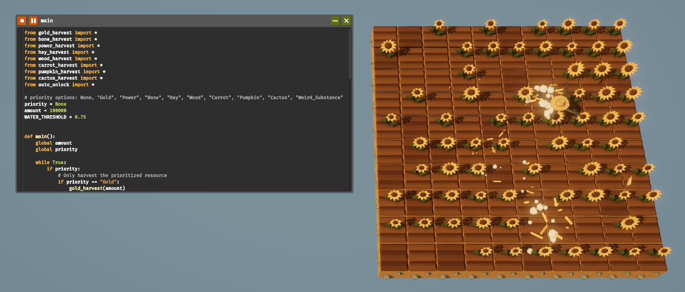

# The Farmer Was Replaced Scripts

Here are my scripts for *The Farmer Was Replaced*, a great automation game [available on Steam](https://store.steampowered.com/app/2060160/The_Farmer_Was_Replaced/). The game uses a language similar to Python to program a farming drone. The goal is to harvest crops and spend them to unlock new functions. The endgame involves competing on the leaderboard while optimizing and refining your code so that the drone can harvest as many crops as possible, as quickly as possible.

## My Goals in the Game

I will be sharing my own scripts here, which I will gradually improve. I’ll also describe what each script currently implements and discuss possible optimizations to improve them further. My goal is to write the most optimal code I can and achieve a high rank on the leaderboard by doing so.

## Differences Between the Game Scripting Language and Python

The game's scripting language is essentially a simplified form of Python. It uses its own built-in functions like `plant()`, `harvest()`, `move()`, `measure()`, `quick_print()`, and others. A good overview of the game's syntax is available on [this Wiki page](https://thefarmerwasreplaced.wiki.gg/wiki/Tooltips_Code).

That being said, some Python features are not available in the game. For example, you cannot use type annotations or docstrings, so my scripts will be documented only with simple comments and notes here. Additionally, importing modules from Python’s standard library is not possible, so advanced features like sorting must be implemented from scratch which adds an extra layer of challenge.

## Scripts overview

### main

This is my main script that handles the management of other scripts and runs them to balance resource harvesting.

#### Currently implemented

- Adjustable `priority` variable that can set priority to only harvest selected resource and ignores the other. Set to `None` if zou want priority harvest disabled and use the if-else decision tree instead.
- Adjustable `amount` variable so you can specify how much of each resource should be harvested.
- Adjustable `WATER_TRESHOLD` constant to set minimum water level to triger watering after planting. Set values from 0 to 1.
- Management of other harvesting scripts using if-else decision tree.
- Automatic run of `auto_unlock` script each time all resources have been cycled through.
- Automatic `amount` increment after each full harvesting cycle.

#### Possible optimizations

- Better resource management and being able to adjust resource ratios rather than just general amount of all resources.
- Fixing the if-else decision tree so it prevents the resource gathering cycle to repeat before all resources are confirmed to be gathered at the minimum of the set `amount`.
- Adding timing and monitoring each scripts performance.
